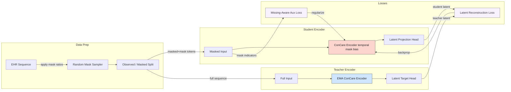
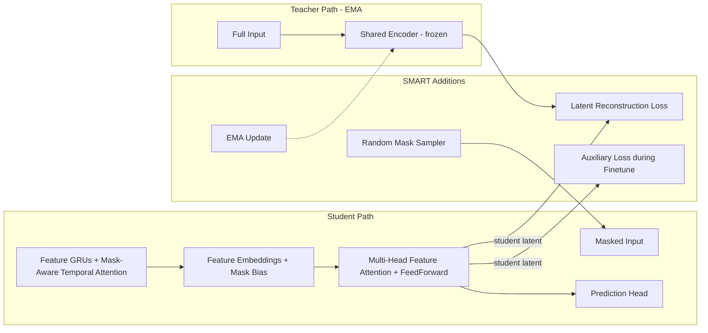
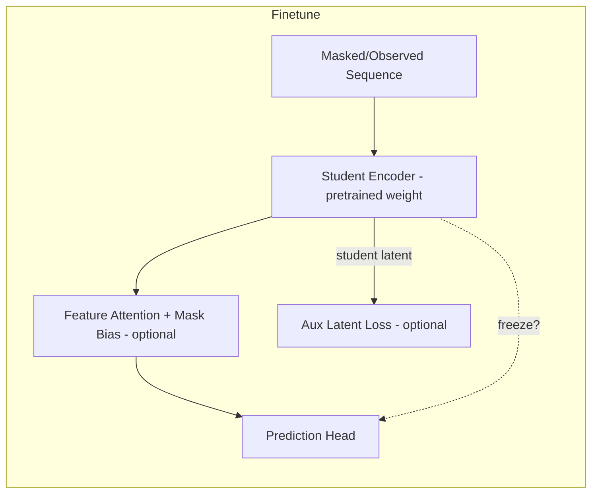

# Missing-Aware Latent Pretraining Diagram

This captures the SMART-style pretraining workflow: random masking produces a student view that the
trainable ConCare encoder must reconstruct against an EMA teacher’s latent targets while also being
regularized by the mask-aware auxiliary loss.

## Architectural Overview

This diagram highlights the modules that extend vanilla ConCare: the randomized masking,
EMA teacher branch, latent reconstruction loss, and optional auxiliary path during finetuning.

### Teacher vs. Student Encoder Dynamics

- **Student encoder** sees a partially masked sequence and learns to produce context vectors that
  are resilient to missing observations.
- **Teacher encoder** is an EMA (Exponential Moving Average) copy with frozen weights that always
  processes the full sequence; its weights are updated via
  `θ_teacher ← decay * θ_teacher + (1 - decay) * θ_student`.
- **Latent reconstruction loss** forces the student’s context representations to match the teacher’s
  targets wherever values were masked, effectively training the student to “hallucinate” plausible
  representations for missing slices.
- **Expected AUROC gain**: by pretraining the student to align with the full-context teacher even when
  measurements drop out, the downstream classifier sees more stable latent features. That stability
  should reduce overfitting to specific observation patterns, improving generalization and therefore
  AUROC/AUPRC on the test set, especially under higher missingness.

### Fine-Tuning Behavior

- Fine-tuning diagram:

- **Student encoder** becomes the trainable backbone during supervised fine-tuning; the teacher is
  discarded except when `--missing_aware_aux_weight > 0`, where it reappears to provide latent targets
  for the auxiliary loss on randomly masked batches.
- **Optional freeze window** (`--missing_aware_freeze_epochs`) keeps the student encoder frozen while
  only the prediction head learns for the first N epochs, reducing catastrophic forgetting of the
  pretraining signal.
- **Mask-biased pooling toggle** (`--missing_aware_disable_mask_bias`) controls whether features that
  are currently observed get an additive bias before the final attention softmax. With the bias **on**,
  features whose mask coverage is high receive larger attention logits, effectively boosting them
  relative to sparse channels; with the bias **off**, all feature embeddings compete on equal footing
  regardless of their observed/missing status.
- NET effect: fine-tuning starts from representations already trained to compensate for missing data,
  and the auxiliary latent loss (if enabled) keeps reinforcing that behavior, leading to a more robust
  AUROC/AUPRC curve than pure baseline ConCare.

## Architectural Additions vs. Baseline ConCare

1. **Latent reconstruction pretraining loop**
   - Adds the EMA teacher clone and random masking path before finetuning.
   - Introduces `_latent_reconstruction_loss` and auxiliary mask sampling (`_mask_random_observations`).

2. **Mask-aware temporal attention**
   - Replaces the vanilla per-feature attention with `MissingAwareTemporalAttention`, incorporating observation masks.

3. **Mask-biased feature pooling**
   - Optionally scales the final attention weights based on per-feature observation coverage (configurable via `--missing_aware_disable_mask_bias`).

4. **Auxiliary reconstruction loss during finetuning**
   - When `--missing_aware_aux_weight > 0`, the student encoder periodically reconstructs full-context latents even during supervised training.

5. **Instrumentation hooks (optional)**
   - `--instrument_signals` layers capture gradients/activations/attention stats so the SMART path’s effects can be compared back to the baseline.
